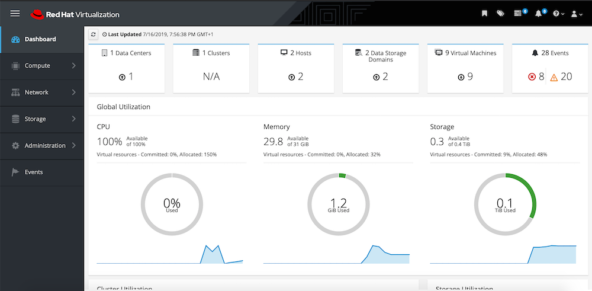
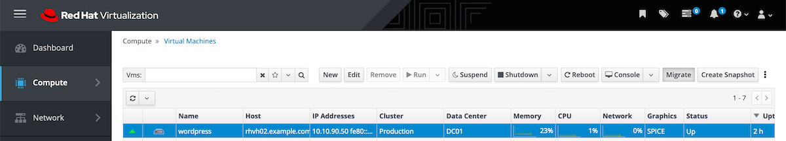

**
## RHV + Ansible Tower Workshop
**

We'll start by logging into the demo environment at: https://bit.ly/2LosqDT  
There, please input your email and code so that a Lab may be assigned to you.

|Activation Code:|rhlisboa|
|-|--|


Example:


Section 1: Red Hat Virtualization Essentials
This first section aims to provide an overview of the Red Hat Virtualization Administration Portal and you’ll learn to:
Start existing virtual machines.
Create virtual machines. 
Access the console of a virtual machine.
Red Hat Virtualization Administration Portal
To access the Red Hat Virtualization Administration Portal, use the URL provided to you (eg. https://rhvm-?GUID?.rhpds.opentlc.com) and click on the link "Administration Portal".


When accessing the Administration Portal login page, use the following credentials (Profile=Internal):

|admin:|r3dh4t1!|
|-|--|


Example:
  

<br />

First screen you’ll see is the main dashboard, which provides an overview of the environment, including information on Data Centers, Clusters, Hosts, Data Storage Domains and Virtual Machines.
On the left side of the screen you may access operations related to compute, network and storage.

Example:
  

<br />

# Lab 1.1 - Explore the Administration Portal
Explore the Administration Portal, but don’t change configurations nor create virtual machines yet.
Virtual Machines View and Essential Operations
This environment already has some existing virtual machines, as you can notice when accessing Compute → Virtual Machines.

Next the instructor will give a brief overview and explanation of the UI.  
Please feel free to follow along or explore on your own, just as long as you don't create or destroy any objects it won't harm the learning curve.

<br />

# Lab 1.2 - Start Virtual Machine 
Using the vertical menu on the left, go to Compute → Virtual Machines.  
Click on the “database” virtual machine name to view its information.
Click on the “wordpress” virtual machine name to view its information.

Click on “Run” button to start the "database" virtual machine.
Click on “Run” button to start the "wordpress" virtual machine.

Click on “Console” to access the virtual machines console, to verify it started properly. Note that you won’t be logging into this virtual machine.

Close the console window when you confirm the virtual machines have started.  

<br />

# Lab 1.3 - Explore the User Admin Portal
RHV has a very handy "VM Portal” that when paired with RBAC, allows for the self-adminstration of VMs by the end-user, without accessing the more vital "Administration Portal".
Go back to the welcome screen by clicking the Red Hat logo in the top left corner.

Click on “VM Portal” link.
You'll be greeted with a view of your VMs (being full admin, this will be all VMs).  

Example:
 


Click on the "database" VM to access the virtual machine self-management page. You'll be able to amongst others: access the virtual console, get an overview of resource consumption, effect power operations, etc.

Example:


Ok, let's get back to the "Admin Portal".

<br />

# Lab 1.3 - Live Migration of the "wordpress" Memory State and of the "database" Virtual Disk 
Let's start by conecting to the wordpress frontend: https://wordpress-GUID.rhpds.opentlc.com  
This will be used to atest availability during the live migration ops. Feel free to browse the site's interface while the following operations take place.

<br />

Using the vertical menu on the left, go to Compute → Virtual Machines.  
Click on the “wordpress” virtual machine row to select it. In the common VM operations, choose Migrate (it will automatically select the other available host).

Example:
  

<br />

Go ahead and click "Migrate"
  
You can check the progress of the migration either on the VMs view or the Tasks view.  

<br />

Now, please select the "database" VM, this time clicking on it's name and then accessing the "Disks" tab in order to live migrate the device.  
  
  
<br />

  
  
<br />

 

In the Tasks view you can now follow the progress of this operation.  

<br />

# Lab 1.4 - Create Virtual Machine AD-HOC
Virtual machines can be created from templates or can have the operating system installed from its installation media. For the purpose of this lab, you’ll be creating a virtual machine from a template.  
Using the vertical menu on the left, go to Compute → Virtual Machines.
Click New to open the New Virtual Machine window.  

Considering this scenario, you’ll be creating a virtual machine with the following information:  
  

|-|--|
|-|--|
|Cluster:|Production|
|Template:|Rhel-7.5-demo base version(1) |
|Operating system:|Red Hat Enterprise Linux 7.x x64  |  
|Instance Type:|Small  |   
|Optimized for:|Server  |  
|Name:|test_vm  |  
|Description:|to_detete  |  
|-|--|


Checkmark:   
Start in Pause Mode  
Delete Protection

For nic1, please select:  
vm public net/vm public net

Keep defaults for everything else.
Click OK.  

When the virtual machine creation finishes, click on Run button.
To access virtual machine console, click on Console button.
ℹ
For more details on all fields in the New Virtual Machine window, see Red Hat Virtualization documentation.
If you’d like to log into the virtual machine operating system, use the following credentials. 

Login: admin  
Password: r3dh4t1!  


### Ansible Tower and Automating day-to-day Ops  


**Ansible is a full DevOps framework, designed from the ground up for simplicity and reduced footprint**  
  

<br />

**IT's main strenghts can be categorized into:**
  
<br />


**By targeting pretty much all techonogy verticals (from Windows OS's to full public cloud IaaS).** 
  
<br />


**Ansible can bridge the gap bettwen traditionally air-tight silos, and enable true to form DevOps interactions.**
  

<br />

**Using human-readable code, organized into Ansible playbooks.**  
  
<br />

**Operators can leverage the tailor-made DevOps Ansible Architecture.**  
  
<br />


Up until now we've talked about the capabilities of the "Ansible Core" engine.  
For true enterprise scale execution and compliance, there's Ansible Tower.  
  

**Ansible Tower is a web-based UI that provides an enterprise solution for IT automation.**  
--> It has a user-friendly dashboard  
--> Complements Ansible, adding automation, visual management, and monitoring capabilities.  
--> Provides user access control to administrators.  
--> Graphically manages or synchronizes inventories with a wide variety of sources.   
--> A RESTful API  
--> And much more…​
<br />  

---

Before start working on Tower, clone this repo in your VM instance:
```
git clone https://github.com/Ansible-RH-Madrid/RHV-Ansible-Workshop.git
```
Copy the files tower-backup to /root/ansible-tower-setup-3.4.1-1/
```
sudo cp -v /root/RHV-Ansible-Workshop/tower-backup* /root/ansible-tower-setup-3.4.1-1/
```
Load the backup in Tower.
```
/root/ansible-tower-setup-3.4.1-1/setup.sh -r 
```
And now let's go ahead and acess the Tower UI: https://tower-GUID.rhpds.opentlc.com/  

|td-admin|r3dh4t1!|
|-|--|


<br />  

**Here you'll be presented with the Tower UI:**  
  

There are some key features of the UI that the instructor will go trough. Please follow to the best of your abilities.  
<br />  

# Lab 2.1 - Explore and Create Organizational Units (Orgs, Teams, Users and Credentials)
Tower enables enterprises to organize and assign responsabilities that conform to their needs. From something as simple as creating local users and groups, to full-fledged Directory Services binding and multi-tenancy.

Let's illustrate this with the creation of an Organization  
  
  
<br />  


Just name it and your done. This will create a top level container for all your Tower objects.
  
 <br />  
 

We can of course create new users either locally or by connecting to a directory service:
  
These users are then used for RBAC modelling.
